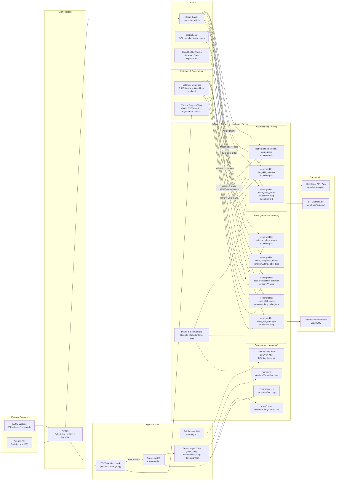

```mermaid
flowchart LR
  subgraph SRC[External Sources]
    ESCO["ESCO Website\nZIP release (versioned)"]
    ADZ["Adzuna API\nDaily job ads (FR)"]
  end

  subgraph ORCH[Orchestration]
    AF["Airflow\nSchedules + retries + backfills"]
  end

  subgraph ING[Ingestion Jobs]
    ESCOCHK["ESCO version check\n(hash/version registry)"]
    ESCODL["Download ZIP\n+ store artifact"]
    ESCOEXT["Extract target CSVs\n(skills_lang, occupations_lang)\nFilter lang=fr|en"]
    ADZPULL["Pull Adzuna daily\n(country=fr)"]
  end

  subgraph LAKE["Object Storage + Lakehouse Tables"]
    MINIO["MinIO (S3-compatible)\nBuckets: skillradar-lake, logs"]

    subgraph BR["Bronze (raw, immutable)"]
      BRZIP["esco/artifact_zip\nversion=V/esco.zip"]
      BRESCO["esco/*_csv\nversion=V/lang=fr|en/*.csv"]
      BRADZ["adzuna/jobs_raw\ndt=YYYY-MM-DD/*.json|parquet"]
      BRMAN["manifests\nversion=V/manifest.json"]
    end

    subgraph SV["Silver (canonical, cleaned)"]
      SSKC["Iceberg table: esco_skill_concepts\nversion=V, lang"]
      SSKL["Iceberg table: esco_skill_labels\nversion=V, lang, label_type"]
      SOCC["Iceberg table: esco_occupation_concepts\nversion=V, lang"]
      SOCL["Iceberg table: esco_occupation_labels\nversion=V, lang, label_type"]
      SADZ["Iceberg table: adzuna_job_postings\ndt, country=fr"]
    end

    subgraph GD["Gold (serving / marts)"]
      IDX["Iceberg table: esco_label_index\nversion=V, lang\n(weights/risk)"]
      MATCH["Iceberg table: job_skill_matches\ndt, country=fr"]
      KPI["Iceberg tables: trends / aggregates\ndt, country=fr"]
    end
  end

  subgraph META["Metadata & Governance"]
    CATALOG["Catalog / Metastore\n(HMS locally -> Glue/Unity in cloud)"]
    REG["Version Registry Table\n(latest ESCO version, ingested dt, checks)"]
  end

  subgraph COMP[Compute]
    SPARK["Spark (batch)\nspark-submit jobs"]
    DBT["dbt (optional)\nSQL models + tests + docs"]
    DQ["Data Quality Checks\ndbt tests / Great Expectations"]
  end

  subgraph CONS[Consumption]
    DASH["BI / Dashboards\nMetabase/Superset"]
    API["Skill Radar API / App\nsearch & analytics"]
    NOTE["Notebooks / Exploration\nSpark/SQL"]
  end

  ESCO --> AF
  ADZ --> AF

  AF --> ESCOCHK --> REG
  ESCOCHK -->|new version| ESCODL --> BRZIP
  ESCODL --> ESCOEXT --> BRESCO
  ESCOEXT --> BRMAN

  AF --> ADZPULL --> BRADZ

  AF --> SPARK
  SPARK -->|Bronze->Silver parse/clean/explode| SSKC
  SPARK --> SSKL
  SPARK --> SOCC
  SPARK --> SOCL
  SPARK --> SADZ

  CATALOG --- SSKC
  CATALOG --- SSKL
  CATALOG --- SOCC
  CATALOG --- SOCL
  CATALOG --- SADZ
  CATALOG --- IDX
  CATALOG --- MATCH
  CATALOG --- KPI

  SPARK -->|Build label index| IDX
  SPARK -->|Match jobs<->skills| MATCH
  SPARK -->|Aggregations| KPI

  DBT -->|Silver->Gold marts| IDX
  DBT --> KPI
  DQ -->|Validate constraints| SV
  DQ --> GD

  GD --> DASH
  GD --> API
  SV --> NOTE

  MINIO --- BR
  MINIO --- SV
  MINIO --- GD
```
