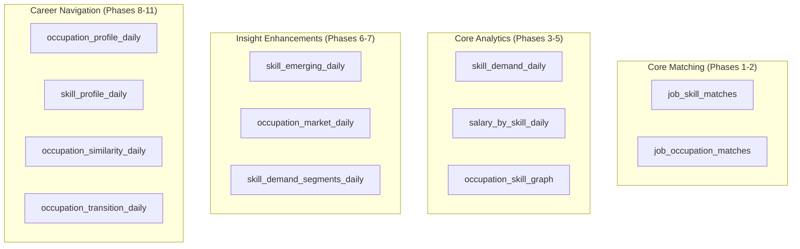

# Data Model

Gold layer schemas, keys, lineage columns, and table contracts.

## Gold Layer Overview

The Gold layer produces 12 analytical datasets divided into four groups:

## Core Matching Tables

### job_skill_matches

Per-job skill matching results with deterministic scoring.

| Column | Type | Description |
|--------|------|-------------|
| `adzuna_job_id` | string | Adzuna job identifier |
| `esco_skill_concept_uri` | string | ESCO skill URI |
| `esco_skill_preferred_label` | string | Skill name |
| `match_source` | string | `title` or `description` |
| `label_type` | string | `preferred` or `alt` |
| `match_score` | double | Deterministic score (0–1) |
| `ingestion_date`, `country` | string | Partition keys |
| `gold_pipeline_version`, `gold_computed_at` | string | Lineage |

**Key:** `(adzuna_job_id, esco_skill_concept_uri, country, ingestion_date)`

### job_occupation_matches

Per-job occupation matching via title exact match and relation inference.

| Column | Type | Description |
|--------|------|-------------|
| `adzuna_job_id` | string | Adzuna job identifier |
| `esco_occupation_concept_uri` | string | ESCO occupation URI |
| `esco_occupation_preferred_label` | string | Occupation name |
| `match_method` | string | `title_exact`, `title_alt`, `skill_relation` |
| `match_confidence` | double | Confidence score |
| `supporting_skill_count` | long | Skills supporting this match |
| `ingestion_date`, `country` | string | Partition keys |
| `gold_pipeline_version`, `gold_computed_at` | string | Lineage |

**Key:** `(adzuna_job_id, esco_occupation_concept_uri, match_method, country, ingestion_date)`

## Core Analytics Tables

### skill_demand_daily

Daily skill demand frequency.

| Column | Type | Description |
|--------|------|-------------|
| `esco_skill_concept_uri` | string | Skill URI |
| `esco_skill_preferred_label` | string | Skill name |
| `jobs_count` | long | Job postings mentioning this skill |
| `companies_count` | long | Distinct companies |
| `locations_count` | long | Distinct locations |
| `avg_match_score` | double | Average match confidence |
| `title_match_count`, `description_match_count` | long | Match source breakdown |
| `ingestion_date`, `country` | string | Partition keys |

**Key:** `(esco_skill_concept_uri, country, ingestion_date)`

### salary_by_skill_daily

Salary statistics per skill.

| Column | Type | Description |
|--------|------|-------------|
| `esco_skill_concept_uri` | string | Skill URI |
| `esco_skill_preferred_label` | string | Skill name |
| `salary_jobs_count` | long | Jobs with salary data |
| `avg_salary_min`, `avg_salary_max`, `avg_salary_mean` | double | Salary stats |
| `ingestion_date`, `country` | string | Partition keys |

**Key:** `(esco_skill_concept_uri, country, ingestion_date)`

### occupation_skill_graph

Occupation ↔ skill relationships enriched with market evidence.

| Column | Type | Description |
|--------|------|-------------|
| `esco_occupation_concept_uri` | string | Occupation URI |
| `esco_skill_concept_uri` | string | Skill URI |
| `relation_type` | string | `essential` or `optional` |
| `matched_jobs_count` | long | Jobs with both occ + skill matched |
| `ingestion_date`, `country` | string | Partition keys |

**Key:** `(esco_occupation_concept_uri, esco_skill_concept_uri, country, ingestion_date)`

## Insight Enhancement Tables

### skill_emerging_daily

Emerging skill detection with momentum, acceleration, and novelty scoring.

| Column | Type | Description |
|--------|------|-------------|
| `esco_skill_concept_uri` | string | Skill URI |
| `momentum_score` | double | Short-term growth rate |
| `acceleration_score` | double | Rate of momentum change |
| `novelty_score` | double | Recency of first appearance |
| `composite_score` | double | Weighted combination |

See [Emerging Skills](../analytics/emerging-skills.md) for the full scoring methodology.

### occupation_market_daily

Daily occupation market indicators — job counts, skill breadth, average match quality.

See [Occupation Market](../analytics/occupation-market.md).

### skill_demand_segments_daily

Skill demand broken down by contract type, location, and other segments via KMeans clustering.

See [ML Features](../analytics/ml-features.md).

## Career Navigation Tables

### occupation_profile_daily

Canonical occupation card with demand, salary, and top skills/companies.

| Column | Type | Description |
|--------|------|-------------|
| `esco_occupation_concept_uri` | string | Occupation URI |
| `esco_occupation_preferred_label` | string | Occupation name |
| `matched_jobs_count` | long | Total matched job postings |
| `distinct_companies_count` | long | Unique hiring companies |
| `avg_salary_mean` | double | Weighted average salary |
| `top_essential_skills_json` | string | JSON array of top essential skills |
| `top_optional_skills_json` | string | JSON array of top optional skills |
| `top_companies_json` | string | JSON array of top companies |

**Key:** `(esco_occupation_concept_uri, country, ingestion_date)`

### skill_profile_daily

Canonical skill card with demand, salary, top occupations/companies.

**Key:** `(esco_skill_concept_uri, country, ingestion_date)`

### occupation_similarity_daily

Pairwise occupation similarity via weighted Jaccard on ESCO skill-set overlap.

| Column | Type | Description |
|--------|------|-------------|
| `source_occupation_uri` | string | Source occupation |
| `target_occupation_uri` | string | Target occupation |
| `similarity_score` | double | Weighted Jaccard (0–1) |
| `shared_skill_count` | long | Shared skills total |

**Key:** `(source_occupation_uri, target_occupation_uri, country, ingestion_date)`

### occupation_transition_daily

Career transition guidance: shared/missing skills, difficulty, market context.

| Column | Type | Description |
|--------|------|-------------|
| `from_occupation_uri` | string | Source occupation |
| `to_occupation_uri` | string | Target occupation |
| `similarity_score` | double | Similarity from pairs table |
| `missing_skills_json` | string | JSON array of skills to acquire |
| `transition_difficulty_score` | double | Weighted difficulty |
| `salary_delta_mean` | double | Salary change (to − from) |
| `jobs_delta` | long | Job count change |

**Key:** `(from_occupation_uri, to_occupation_uri, country, ingestion_date)`

## Scoring Matrix

Skill match scoring uses a deterministic 6-cell matrix based on `label_type × match_source`:

| | Title | Description |
|---|---|---|
| **Preferred label** | 1.0 | 0.8 |
| **Alt label** | 0.9 | 0.7 |

## Lineage Columns

Every Gold row carries lineage:

| Column | Description |
|--------|-------------|
| `gold_pipeline_version` | Git-derived version of the pipeline code |
| `gold_computed_at` | ISO UTC timestamp of computation |

## References

- [Lakehouse Layout](lakehouse.md) — table FQNs and inventory
- [Gold Pipeline](../pipelines/gold.md) — matching and analytics implementation
- [Career Navigation](../pipelines/career-navigation.md) — Phases 8–11 details
