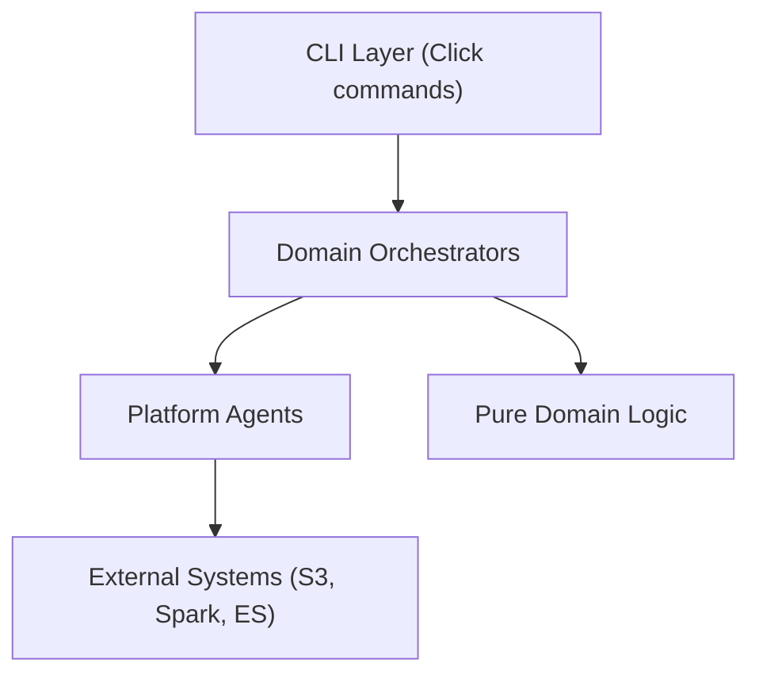
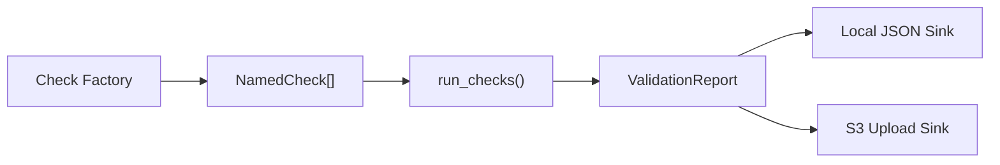

# Modular Design

Design philosophy, layered architecture, SSOT principle, and platform agent contracts.

## Governing Principles

### 1. Modularity

Each component does one thing and exposes a clean interface. A CLI command never queries S3 directly — it calls an orchestrator that delegates to platform agents.

### 2. Delegation

Business logic stays in **pure functions** (zero I/O, zero side effects). I/O lives in **platform agents** (`S3Client`, `LakeLayout`, `IcebergWriter`). Orchestrators sequence calls but contain no logic.

### 3. Single Source of Truth (SSOT)

Every fact is defined exactly once:
- Table names → `LakeLayout`
- Schemas → `schema.py` per domain
- Config → `PlatformSettings` (Pydantic)
- Infrastructure requirements → `requirements.py`

## Layered Architecture



### Layer 1 — CLI (Thin Entry Points)

Click commands in `src/skill_radar/cli/`. Parse arguments, load config, call orchestrator, report results. No business logic.

```
cli/
├── esco.py        # ESCO dataset commands
├── adzuna.py      # Adzuna dataset commands
├── gold.py        # Gold layer commands
├── search.py      # Search & Kibana commands
├── infra.py       # Infrastructure provisioning
├── validate.py    # Validation commands
└── run.py         # Stage unit commands (used by Airflow)
```

### Layer 2 — Domain Orchestrators

Sequence platform agent calls. Contain no I/O logic. Return structured results (dataclasses with row counts, timing, validation reports).

```
domains/
├── esco/orchestrator.py
├── adzuna/orchestrator.py
├── gold/orchestrator.py
└── search/orchestrator.py
```

### Layer 3 — Platform Agents

Encapsulate external system interactions behind clean interfaces:

| Agent | Module | Responsibility |
|-------|--------|----------------|
| `LakeLayout` | `platform/lake/layout.py` | Table FQN resolution, path construction |
| `S3Client` | `platform/lake/s3.py` | Bucket operations, upload, download |
| `ManifestBuilder` | `platform/lake/manifest.py` | Landing zone manifests |
| `RuntimeContext` | `platform/lake/context.py` | Host vs Docker detection |
| `ConfigLoader` | `config/loader.py` | Layered configuration (YAML → env → CLI) |
| `ElasticsearchClient` | `platform/search/elasticsearch.py` | Index CRUD, bulk indexing |
| `KibanaClient` | `platform/search/kibana.py` | Saved object import |

### Layer 4 — Pure Domain Logic

Functions with zero I/O. Accept DataFrames / dicts, return DataFrames / dicts. Fully testable in isolation.

Examples:
- `domains/esco/transforms.py` — ESCO normalization and dedup
- `domains/adzuna/transforms.py` — Adzuna row mapping and dedup
- `domains/gold/matching/` — skill and occupation matching logic
- `domains/gold/analytics/` — KPI computation, scoring

## SSOT Table Mapping

`LakeLayout` is the single source of truth for all Iceberg table names:

```python
layout = LakeLayout()

# Bronze
layout.esco_bronze_fqn("skills")  # → "sr.sr_bronze.esco_skills_raw"
layout.adzuna_bronze_fqn()        # → "sr.sr_bronze.adzuna_jobs_raw"

# Silver
layout.esco_silver_fqn("skills")  # → "sr.sr_silver.esco_skills"
layout.adzuna_silver_fqn()        # → "sr.sr_silver.adzuna_jobs"

# Gold (12 tables)
layout.gold_skill_demand_fqn()    # → "sr.sr_gold.skill_demand_daily"
```

## Validation Framework



- **NamedCheck** — identity + callable, preserves check name for skip cascading
- **run_checks()** — sequential execution with timing, JVM crash detection
- **ValidationReport** — aggregated result with per-check metrics
- **Sinks** — local filesystem + optional S3 upload

See [Validation System](../platform/validation.md) for the full framework reference.

## Structured Observability

All domain operations report via `RunContext` (stored as a `ContextVar`):
- Run ID correlation across log lines
- Structured JSON validation reports with timing
- Lineage columns on every table row (`pipeline_version`, `computed_at`)
- Optional S3 report upload for centralized logging

## Idempotent Infrastructure

The **apply → validate** pattern ensures safe re-runs:

1. `apply` — create-if-not-exists (idempotent)
2. `validate` — read-only verification

Both phases use `get_platform_requirements()` as the single source of required resources.

## References

- [Architecture Overview](overview.md) — project goals and technology stack
- [System Components](system-components.md) — runtime configuration details
- [Validation System](../platform/validation.md) — full check framework reference
