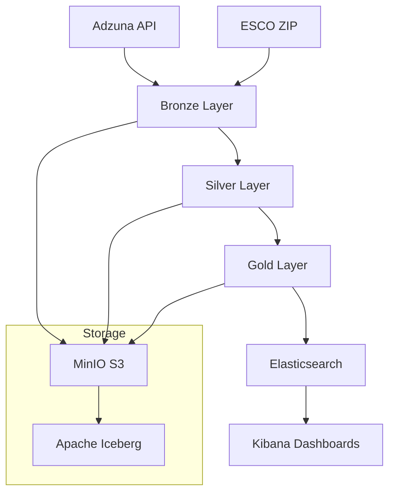

# Architecture Overview

Project context, goals, data sources, milestones, and technology stack for Skill Radar.

## Context

The job market evolves rapidly, but structured analysis of technology demand, salary trends, and career pathways remains fragmented. Skill Radar bridges this gap by building a production-grade data engineering platform that cross-references live job postings with the European skills taxonomy.

## Goals

1. **Ingest** fresh job postings daily from the Adzuna API across multiple countries
2. **Normalize** data through a structured lakehouse pipeline (Bronze → Silver → Gold)
3. **Cross-reference** job postings with the ESCO European skills/occupations taxonomy
4. **Produce** 12 analytical datasets covering demand, salary, skill matching, career navigation
5. **Serve** results via Elasticsearch indices and Kibana dashboards

## Data Sources

### Adzuna API

REST API providing real-time job postings. Features:
- Pagination with configurable page size
- Country-specific endpoints (`fr`, `gb`, `de`, etc.)
- Fields: title, description, company, location, salary range, category, URL
- Rate-limited; credentials required (`ADZUNA_APP_ID` / `ADZUNA_APP_KEY`)

### ESCO Taxonomy (European Skills, Competences, Qualifications, and Occupations)

Reference taxonomy from the European Commission:
- ~13,500 skills with types, groups, hierarchies
- ~3,000 occupations with ISCO group mappings
- Skill ↔ Occupation relations (essential / optional)
- Multilingual (French used by default)
- Distributed as a ZIP of CSV files, manually downloaded

## Architecture

## Technology Stack

| Component | Technology | Role |
|-----------|-----------|------|
| Object Storage | MinIO (S3-compatible) | Lakehouse persistence |
| Table Format | Apache Iceberg | ACID transactions, schema evolution, time travel |
| Compute Engine | Apache Spark 3.5.7 | Distributed data processing |
| Orchestration | Apache Airflow 2.9.3 | Pipeline scheduling via DockerOperator |
| Search & Dashboards | Elasticsearch 8.13 + Kibana 8.13 | Serving layer and visualization |
| Package Manager | uv | Deterministic Python dependency management |
| CLI Framework | Click | User-facing command interface |
| Testing | pytest | Unit, integration, E2E tests |
| Linting | ruff + mypy | Code quality and type safety |

## Milestones

| Milestone | Scope |
|-----------|-------|
| M1 — Foundation | Infrastructure, ESCO Landing/Bronze/Silver, validation framework |
| M2 — Adzuna Integration | API client, Bronze/Silver, deduplication, config layering |
| M3 — Gold Analytics | Skill/occupation matching, 5 core datasets, scoring matrix |
| M4 — Serving & Insights | Search export, Kibana dashboards, emerging skills, career navigation |

## Engineering Principles

- **Idempotency** — every pipeline stage can be safely re-run
- **Traceability** — lineage columns (`dataset`, `version`, `pipeline_version`, `computed_at`) on every row
- **Quality gates** — validation checks at every stage with structured JSON reports
- **Dockerized compute** — all processing runs in containers; Airflow acts as control-plane only
- **Deterministic builds** — `uv.lock` pins exact dependency versions
- **Strict CI gates** — lint + format + types + unit tests on every change

## Value Proposition

Skill Radar answers questions like:
- Which technical skills are most demanded in France today?
- What is the average salary for Python developers?
- Which occupations share the most skills (career transitions)?
- What new skills are emerging with the highest momentum?
- How does skill demand break down by region, company, or contract type?

## References

- [Modular Design](modular-design.md) — layered architecture and design philosophy
- [System Components](system-components.md) — Spark, MinIO, Iceberg configuration
- [Lakehouse Layout](lakehouse.md) — bucket structure and naming conventions
- [Data Model](data-model.md) — Gold layer schemas
