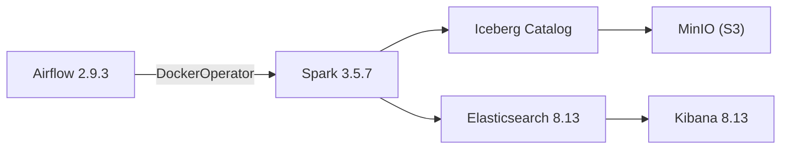

# System Components

Spark runtime, MinIO, Iceberg, and Docker configuration details.

## Component Overview



## MinIO (Object Storage)

S3-compatible object storage serving as the lakehouse persistence layer.

| Setting | Value |
|---------|-------|
| Image | `minio/minio:latest` |
| API Port | `9000` |
| Console Port | `9001` |
| Default credentials | `minioadmin` / `minioadmin` |
| Buckets | `skillradar-lake` (data), `skillradar-logs` (reports) |

## Apache Spark

### Runtime

| Setting | Value |
|---------|-------|
| Image | `docker/spark/Dockerfile` (custom) |
| Spark version | 3.5.7 |
| Java version | 11 (not 17 — see below) |
| Iceberg version | 1.7.1 |
| Scala version | 2.12 |
| Platform | `linux/amd64` (forced for aarch64 compatibility) |

### Why Java 11?

Java 17 on `aarch64` triggers `java.lang.UnsatisfiedLinkError` in `libsnappyjava.so` during Iceberg Parquet writes. Java 11 avoids this entirely. The fix is pinned in the Spark Dockerfile.

### Spark Configuration

Key settings from `configs/spark-defaults.conf`:

| Property | Value | Purpose |
|----------|-------|---------|
| `spark.sql.extensions` | `IcebergSparkSessionExtensions` | Iceberg SQL support |
| `spark.sql.catalog.sr` | `SparkCatalog` (Hadoop type) | Iceberg catalog |
| `spark.sql.catalog.sr.warehouse` | `s3a://skillradar-lake/warehouse` | Data lake root |
| `spark.sql.codegen.wholeStage` | `false` | Disabled — avoids JVM codegen issues in containers |
| `spark.hadoop.fs.s3a.endpoint` | `http://minio:9000` | MinIO endpoint (Docker network) |
| `spark.hadoop.fs.s3a.path.style.access` | `true` | Required for MinIO |
| `spark.hadoop.fs.s3a.impl` | `S3AFileSystem` | S3A filesystem driver |

### Cross-Architecture Note

The Docker image forces `--platform=linux/amd64` for consistent behavior. On Apple Silicon, this runs via Rosetta 2 emulation. The `DOCKER_DEFAULT_PLATFORM=linux/amd64` environment variable is also set in `docker-compose.yml`.

### Runtime Diagnostics

```bash
# Print Spark runtime info (versions, arch, config)
make diagnostics

# Or via CLI
skill-radar run diagnostics
```

## Apache Iceberg

| Setting | Value |
|---------|-------|
| Catalog name | `sr` |
| Catalog type | Hadoop |
| Warehouse path | `s3a://skillradar-lake/warehouse` |
| Namespaces | `sr_bronze`, `sr_silver`, `sr_gold` |
| Write format | Parquet |
| Partition overwrite | Dynamic (mode `overwrite`) |

## Elasticsearch + Kibana

| Setting | Value |
|---------|-------|
| ES Image | `elasticsearch:8.13.4` |
| Kibana Image | `kibana:8.13.4` |
| ES Port | `9200` |
| Kibana Port | `5601` |
| Security | Disabled (`xpack.security.enabled=false`) |
| Discovery | Single-node |

## Configuration Entry Points

| File | Purpose |
|------|---------|
| `docker-compose.yml` | Service definitions, volumes, networks, profiles |
| `configs/spark-defaults.conf` | Spark session configuration |
| `configs/log4j2.properties` | Spark logging configuration |
| `docker/spark/Dockerfile` | Spark image build (Java 11, Iceberg JARs, uv) |
| `docker/spark/fetch-jars.sh` | Downloads Iceberg and Hadoop AWS JARs |
| `docker/airflow/Dockerfile` | Airflow image build |
| `.env` | Environment variables for all services |

## References

- [Architecture Overview](overview.md) — technology stack summary
- [Lakehouse Layout](lakehouse.md) — bucket structure and Iceberg namespaces
- [Modular Design](modular-design.md) — how components interact
