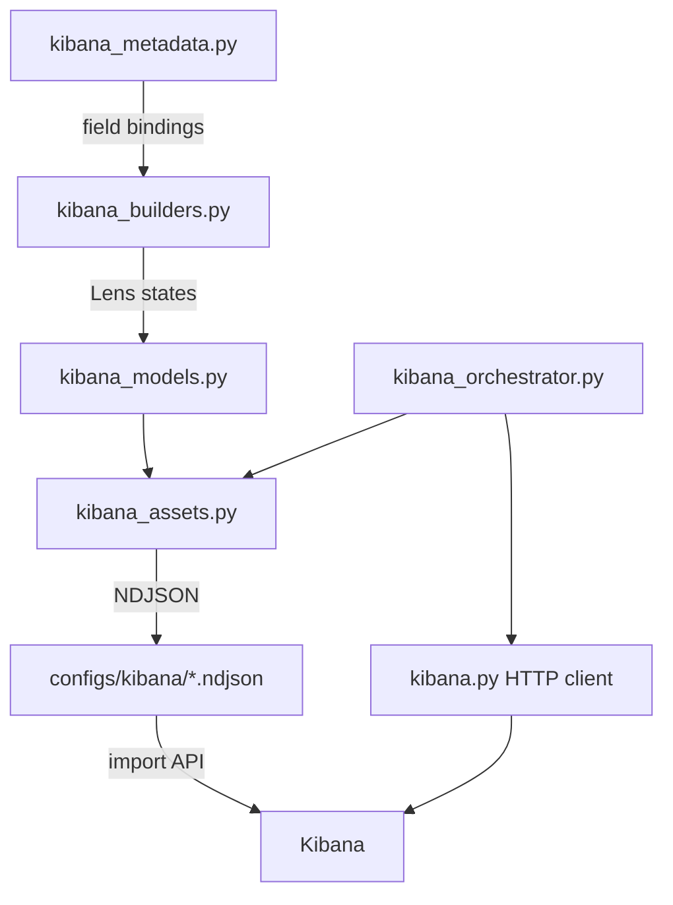

# Dashboard Overview

Code-managed, reproducible Kibana dashboards for Skill Radar.

## Purpose

All Kibana assets — data views, visualizations, dashboards, saved searches — are generated deterministically from Python code. No manual Kibana UI authoring is used. This ensures reproducibility, version control, and environment parity.

## Architecture



### Layer Responsibilities

| Layer | Module | Responsibility |
|-------|--------|----------------|
| **Metadata** | `domains/search/kibana_metadata.py` | Field bindings, dataset config, validation |
| **Builders** | `platform/search/kibana_builders.py` | Lens visualization states and dashboard layouts |
| **Models** | `platform/search/kibana_models.py` | Typed saved object representations |
| **Assets** | `platform/search/kibana_assets.py` | NDJSON generation, writing, expected inventory |
| **Client** | `platform/search/kibana.py` | HTTP calls to Kibana Saved Objects API |
| **Orchestrator** | `domains/search/kibana_orchestrator.py` | Generate/apply/bootstrap workflow |

## NDJSON Pipeline

1. **Generate**: `skill-radar search dashboard export` → writes `configs/kibana/skill_radar_dashboards.ndjson`
2. **Apply**: `skill-radar search dashboard apply` → pushes via `POST /api/saved_objects/_import`
3. **Validate**: `make validate-kibana` → checks dashboards and data views exist

Objects are ordered by dependency: data views → saved searches → visualizations → dashboards.

## Deterministic ID Scheme

| Object Type | Pattern | Example |
|-------------|---------|---------|
| Data View | `{prefix}-dv-{suffix}` | `skillradar-dv-skill-demand-daily` |
| Visualization | `skillradar-vis-{dashboard}-{viz}` | `skillradar-vis-market-overview-top-skills-bar` |
| Dashboard | `skillradar-dash-{slug}` | `skillradar-dash-market-overview` |
| Saved Search | `skillradar-ss-{suffix}` | `skillradar-ss-skill-demand-daily` |

## Data Views

Each served dataset gets a dedicated Kibana data view:

| Data View | Index Pattern | Time Field |
|-----------|--------------|------------|
| Skill Demand Daily | `skillradar-skill-demand-daily-*` | `ingestion_date` |
| Salary by Skill Daily | `skillradar-salary-by-skill-daily-*` | `ingestion_date` |
| Occupation-Skill Graph | `skillradar-occupation-skill-graph-*` | `ingestion_date` |
| Occupation Profile Daily | `skillradar-occupation-profile-daily-*` | `ingestion_date` |
| + 6 more career nav / insight datasets | ... | `ingestion_date` |

10 data views total. Data view IDs follow: `{index_prefix}-dv-{index_suffix}`.

## Design Decisions

- **Code-managed**: Same code = same dashboards across all environments
- **Lens format**: Kibana 8.x standard, supports all common chart types
- **NDJSON over direct API**: Enables offline inspection, manual review, archival, and rollback
- **Metadata / builder separation**: Adding a field = edit metadata only; changing a chart = edit builder only

## How to Extend

### Adding a New Dashboard

1. Define `DashboardDatasetMeta` in `kibana_metadata.py` with field bindings
2. Add to `DASHBOARD_DATASETS` and `PRIMARY_DASHBOARD_DATASETS` registries
3. Create builder function in `kibana_builders.py`
4. Update expected inventory in `kibana_assets.py`
5. Run tests: `uv run pytest tests/unit/platform/search/test_kibana_builders.py -v`

### Adding a Visualization

Edit the corresponding `_build_*` function in `kibana_builders.py`.

### Changing Field Bindings

Edit `FieldMeta` entries in `kibana_metadata.py` only. The `agg_field` parameter handles `.raw` sub-fields automatically.

## Operational Reference

```bash
# Generate NDJSON
make export-kibana-assets
skill-radar search dashboard export

# Apply to Kibana
make apply-kibana-assets
skill-radar search dashboard apply [--dry-run]

# Validate
make validate-kibana
```

## References

- [Kibana Dashboards](kibana.md) — dashboard inventory and visualizations
- [Career Navigation Explorer](career-navigation-explorer.md) — occupation profiles dashboard
- [Search Pipeline](../pipelines/search.md) — data export to Elasticsearch
