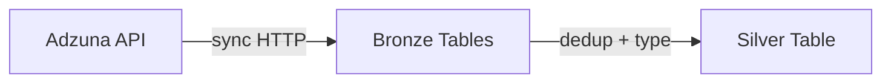

# Adzuna Pipeline

API extraction of job postings through Bronze → Silver with deduplication and validation.

## Purpose

Ingest fresh job postings daily from the Adzuna REST API, store them as raw Iceberg tables, then clean and deduplicate into Silver for Gold-layer matching.

## Architecture



## API Client

The Adzuna client (`domains/adzuna/client.py`) uses synchronous HTTP with built-in retry logic.

### Error Hierarchy

| Exception | Meaning | Retry? |
|-----------|---------|--------|
| `AdzunaError` | Base class | — |
| `AdzunaAuthError` | Invalid credentials (401/403) | No |
| `AdzunaRateLimitError` | Rate limit exceeded (429) | Yes (backoff) |
| `AdzunaApiError` | Other API errors (5xx, network) | Yes |

### Configuration

| Parameter | Default | Description |
|-----------|---------|-------------|
| `country` | `fr` | Target country code |
| `max_pages` | Config-driven | Pages to fetch per run |
| `results_per_page` | `50` | Results per API page |
| `ingestion_date` | Today | Partition date |

Config layering: contract defaults → YAML config → environment variables → CLI flags.

## Stage 1 — Bronze

### Tables

| Table | Partitioning | Purpose |
|-------|-------------|---------|
| `sr.sr_bronze.adzuna_jobs_raw` | `(ingestion_date, country)` | One row per job posting (31 columns) |
| `sr.sr_bronze.adzuna_request_log_raw` | `(ingestion_date, country)` | One row per API request (lineage) |

### Row Mapping

The API response is flattened into 31 columns covering:
- Job identity: `id`, `title`, `description`, `created`, `redirect_url`
- Company/location: `company_display_name`, `location_display_name`, `latitude`, `longitude`
- Salary: `salary_min`, `salary_max`, `salary_is_predicted`
- Classification: `category_label`, `category_tag`, `contract_type`, `contract_time`
- Lineage: `ingestion_date`, `country`, `bronze_loaded_at`, `adzuna_pipeline_version`

### Design Decisions

- **Append-only**: New ingestion dates create new partitions, never overwriting historical data
- **Request log sidecar**: Every API request is logged with page number, result count, URL, and timing for full auditability
- **All-string Bronze**: Raw API values preserved without type coercion

### CLI

```bash
skill-radar adzuna bronze --country fr --max-pages 5 --ingestion-date 2025-01-15
```

## Stage 2 — Silver

### Table

`sr.sr_silver.adzuna_jobs` — 41 columns, partitioned by `(country, ingestion_date)`.

### Transformations

1. Type casting: salary fields → `DoubleType`, coordinates → `DoubleType`, booleans → `BooleanType`
2. Null normalization: empty strings → `null`
3. Window deduplication: `ROW_NUMBER() OVER (PARTITION BY country, id ORDER BY bronze_loaded_at DESC)` — keeps latest version per job
4. Partition overwrite: replaces target `(country, ingestion_date)` partition

### Added Columns (Silver)

- `adzuna_silver_processed_at` — processing timestamp
- `adzuna_silver_pipeline_version` — code version
- Normalized location fields, salary computations

### Design Decisions

- **Window dedup on `(country, id)`**: A job can appear in multiple Bronze ingestions; Silver keeps only the latest
- **Partition overwrite mode**: Safe re-runs replace the same Silver partition
- **Defensive null handling**: All nullable fields explicitly handled

### CLI

```bash
skill-radar adzuna silver --country fr --ingestion-date 2025-01-15
```

## Validation

| Stage | Checks | Count |
|-------|--------|-------|
| Bronze | Table exists, non-empty, schema correct, lineage present, row counts | 11 |
| Silver | Table exists, non-empty, schema correct, no duplicates, key population | 9 |

## Module Map

```
src/skill_radar/domains/adzuna/
├── orchestrator.py    # Sequences bronze → silver
├── client.py          # Adzuna API client (sync HTTP, retry)
├── bronze.py          # API → Iceberg extraction
├── silver.py          # Dedup, type casting, normalization
├── transforms.py      # Pure transform functions
├── models.py          # Pydantic models for API responses
└── contract.py        # Schema contract definitions
```

## Testing

68 unit tests covering:
- API client (mocked HTTP, error scenarios, retry logic)
- Row mapping (all 31 Bronze columns)
- Silver transforms (dedup, type casting, nulls)
- Validation checks (schema, lineage, counts)

```bash
uv run pytest tests/unit/domains/adzuna/ -v
```

## Operational Reference

```bash
# Full Adzuna pipeline
make run-adzuna ADZUNA_COUNTRY=fr

# Individual steps
make adzuna-bronze ADZUNA_COUNTRY=fr ADZUNA_MAX_PAGES=5
make adzuna-silver ADZUNA_COUNTRY=fr

# Validation only
skill-radar validate adzuna-bronze
skill-radar validate adzuna-silver
```

## References

- [Pipeline Overview](overview.md) — medallion architecture
- [Gold Pipeline](gold.md) — downstream matching and analytics
- [Lakehouse Layout](../architecture/lakehouse.md) — table FQNs
