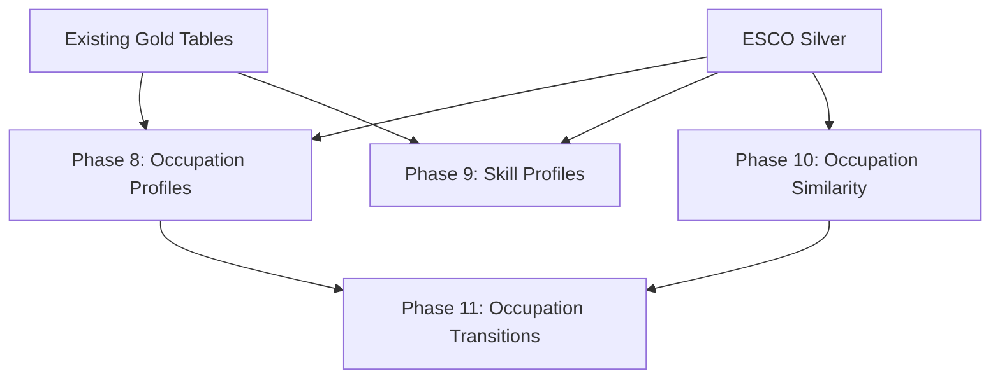

# Career Navigation Pipeline

Four Gold-layer analytical datasets enabling occupation/skill exploration, similarity analysis, and career transition guidance.

## Purpose

Build rich occupation and skill profiles, compute pairwise occupation similarity, and generate career transition guidance — all from existing Gold tables and ESCO Silver dimensions without new ingestion.

## Architecture



## Dataset Summary

| Phase | Dataset | Grain | Purpose |
|-------|---------|-------|---------|
| 8 | `occupation_profile_daily` | occupation × date × country | Canonical occupation card |
| 9 | `skill_profile_daily` | skill × date × country | Canonical skill card |
| 10 | `occupation_similarity_daily` | source × target occ × date × country | Pairwise similarity |
| 11 | `occupation_transition_daily` | from × to occ × date × country | Transition difficulty + gaps |

All datasets use soft-fail semantics — failures never break the core pipeline.

## Phase 8 — Occupation Profile Daily

Aggregates demand metrics, salary context, top skills, and top companies per ESCO occupation.

### Key Columns

| Column | Description |
|--------|-------------|
| `matched_jobs_count` | Total matched job postings |
| `distinct_companies_count` | Unique hiring companies |
| `avg_salary_mean` | Weighted average salary |
| `top_essential_skills_json` | JSON array of top essential skills |
| `top_optional_skills_json` | JSON array of top optional skills |
| `top_companies_json` | JSON array of top hiring companies |

### Data Sources

Reads from Gold matches (`job_skill_matches`, `job_occupation_matches`), `salary_by_skill_daily`, and ESCO Silver occupations/relations.

## Phase 9 — Skill Profile Daily

Aggregates demand, salary, top occupations, and top companies per ESCO skill.

### Key Columns

| Column | Description |
|--------|-------------|
| `jobs_count` | Total matched job postings |
| `avg_salary_mean` | Average salary across matched jobs |
| `top_occupations_json` | JSON array of top related occupations |
| `top_companies_json` | JSON array of top hiring companies |

### Data Sources

Reads from Gold demand (`skill_demand_daily`), `salary_by_skill_daily`, matches, and ESCO Silver skills.

## Phase 10 — Occupation Similarity Daily

Computes pairwise occupation similarity using **weighted Jaccard** on ESCO skill-set overlap.

### Algorithm

```
score = (w_essential × |shared_essential| + w_optional × |shared_optional|)
      / (w_essential × |union_essential|  + w_optional × |union_optional|)
```

Default weights: `w_essential = 2.0`, `w_optional = 1.0`. Self-pairs are excluded. Top-N most similar targets per source retained (default N = 20).

### Data Sources

Reads only ESCO Silver relations and occupations — no dependency on market data.

## Phase 11 — Occupation Transition Daily

Provides career transition guidance: shared skills, missing skills (gap analysis), difficulty score, and market context.

### Algorithm

```
missing_essential = essential(target) - all_skills(source)
missing_optional  = optional(target)  - all_skills(source)
difficulty        = w_essential × |missing_essential| + w_optional × |missing_optional|
```

### Key Columns

| Column | Description |
|--------|-------------|
| `shared_skills_json` | Skills you already have |
| `missing_skills_json` | Skills to acquire |
| `missing_essential_skills_json` | Critical missing skills |
| `transition_difficulty_score` | Weighted difficulty |
| `salary_delta_mean` | Salary change (to − from) |
| `jobs_delta` | Job count change (to − from) |

### Data Dependencies

Requires Phase 10 output (similarity pairs) and Phase 8 output (occupation profiles for salary/jobs context). If either is unavailable, Phase 11 is skipped with a warning.

## Configuration

Parameters in `PlatformSettings` under `gold_analytics.career_nav`:

```yaml
gold_analytics:
  career_nav:
    similarity:
      top_n: 20           # Max nearest neighbours per occupation
      w_essential: 2.0    # Essential skill weight
      w_optional: 1.0     # Optional skill weight
    transition:
      w_essential: 2.0    # Penalty per missing essential skill
      w_optional: 1.0     # Penalty per missing optional skill
    top_skills: 30         # Max skills in profile JSON fields
    top_companies: 20      # Max companies in profile JSON fields
    top_occupations: 30    # Max occupations in skill-profile JSON
```

## Search Serving

All four datasets are exported to Elasticsearch with dedicated index mappings and served via Kibana. JSON array fields (skills, companies, occupations) are mapped as non-indexed text to keep documents self-contained without bloating the inverted index.

See [Career Navigation Explorer](../dashboards/career-navigation-explorer.md) for the dashboard.

## Validation

Each dataset gets 7 standard Gold validation checks:
1. `table_exists`, `non_empty`, `schema`, `partition_non_empty`, `positive_counts`, `no_duplicates`, `lineage`

## Module Map

```
src/skill_radar/domains/gold/analytics/
├── orchestrator.py              # Phases 8-11 sequencing
├── occupation_profiles.py       # Phase 8
├── skill_profiles.py            # Phase 9
├── occupation_similarity.py     # Phase 10
└── occupation_transitions.py    # Phase 11

src/skill_radar/config/models.py  # SimilarityConfig, TransitionConfig, CareerNavigationConfig
```

## References

- [Gold Pipeline](gold.md) — full Gold phase overview
- [Data Model](../architecture/data-model.md) — complete schemas
- [Career Navigation Explorer](../dashboards/career-navigation-explorer.md) — Kibana dashboard
- [Pipeline Overview](overview.md) — where career nav fits in the pipeline
