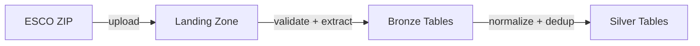

# ESCO Pipeline

Ingestion of the ESCO European Skills taxonomy from ZIP artifact through Landing → Bronze → Silver.

## Purpose

Transform the ESCO CSV dataset (skills, occupations, relations, hierarchies) into normalized, deduplicated Iceberg tables ready for Gold-layer matching.

## Architecture



## Contract System

All ESCO processing is driven by `contract.yaml` — a declarative specification that defines:

- **Entities**: which CSV files to process (skills, occupations, relations, etc.)
- **Column mappings**: CSV columns → Iceberg column names (renames)
- **Newline fields**: columns requiring embedded newline handling
- **Required columns**: validation expectations per entity

The contract is the single source of truth for ESCO schema mapping. Adding a new entity means adding an entry to the contract — no code changes required in transforms.

### Entity List

| Entity | CSV Source | Purpose |
|--------|-----------|---------|
| `skills` | `skills_fr.csv` | Skill definitions with URIs, labels, types |
| `occupations` | `occupations_fr.csv` | Occupation definitions and ISCO codes |
| `skill_groups` | `skillGroups_fr.csv` | Skill group hierarchy |
| `occupation_skill_relations` | `occupationSkillRelations_fr.csv` | Essential/optional skill bindings |
| `skill_skill_relations` | `skillSkillRelations_fr.csv` | Skill-to-skill relations |
| `broader_relations_skill_pillar` | `broaderRelationsSkillPillar_fr.csv` | Skill hierarchy |
| `broader_relations_occ_pillar` | `broaderRelationsOccPillar_fr.csv` | Occupation hierarchy |
| `skills_hierarchy` | `skillsHierarchy_fr.csv` | Full skill tree |
| `isco_groups` | `ISCOGroups_fr.csv` | ISCO classification groups |

## Stage 1 — Landing

Uploads the ESCO ZIP to the S3 landing zone with validation and manifest creation.

### Workflow

1. Validate the ZIP artifact (size, structure, expected CSVs)
2. Compute SHA-256 checksum
3. Upload to `s3a://skillradar-lake/data/landing/esco/{version}/{lang}/`
4. Create `manifest.json` with checksum, version, timestamp, and file inventory
5. Validate manifest schema

### CLI

```bash
skill-radar esco upload --version v1.2.1 --lang fr [--force]
```

## Stage 2 — Bronze

Extracts CSVs from the landing zone artifact and writes raw Iceberg tables.

### Workflow

1. Download artifact from S3 landing zone
2. Stage to local temp directory
3. For each entity in contract:
   - Read CSV with Spark (`inferSchema=false`, all strings)
   - Apply column renames from contract
   - Add lineage columns (`dataset`, `version`, `lang`, `bronze_loaded_at`)
   - Validate schema against contract
   - Write to `sr.sr_bronze.esco_{entity}_raw` (partition overwrite)
4. Run Bronze validation checks

### Design Decisions

- **All-string Bronze**: `inferSchema=false` preserves raw data exactly as received
- **Partition overwrite**: Re-running replaces the exact `(dataset, version, lang)` partition
- **Contract-driven mapping**: Pure functions transform based on contract, not hardcoded logic

### CLI

```bash
skill-radar esco bronze --version v1.2.1 --lang fr [--entities skills,occupations]
```

## Stage 3 — Silver

Normalizes Bronze tables into typed, deduplicated Silver tables.

### Workflow

1. Read Bronze table for each entity
2. Apply type casting and normalization:
   - URI fields → trimmed strings
   - Boolean fields → Spark BooleanType
   - Embedded newlines → cleaned (fields declared in contract)
   - Alt labels → array type (pipe-separated → `array<string>`)
3. Deduplicate by primary key (deterministic: first occurrence by URI sort order)
4. Write to `sr.sr_silver.esco_{entity}` (partition overwrite)
5. Run Silver validation checks

### Design Decisions

- **Deterministic dedup**: `row_number()` with `ORDER BY concept_uri` ensures reproducible output
- **Arrays vs exploded rows**: Alt labels stored as arrays (not exploded) to preserve one-row-per-entity semantics
- **Partition overwrite**: Same version+lang replaces previous run cleanly

### CLI

```bash
skill-radar esco silver --version v1.2.1 --lang fr [--entities skills,occupations]
```

## Module Map

```
src/skill_radar/domains/esco/
├── orchestrator.py     # Sequences landing → bronze → silver
├── contract.py         # Loads and validates contract.yaml
├── contract.yaml       # Entity/column mapping specification
├── landing.py          # ZIP upload, manifest, checksum
├── bronze.py           # CSV → Iceberg extraction
├── silver.py           # Normalization, dedup, type casting
└── transforms.py       # Pure transform functions (zero I/O)
```

## Validation

| Stage | Checks |
|-------|--------|
| Landing | Artifact exists, manifest valid, checksum matches, version supported |
| Bronze | Tables exist, non-empty, schema correct, lineage present |
| Silver | Tables exist, non-empty, schema correct, no duplicates |

## Operational Reference

```bash
# Full ESCO pipeline
make run-esco-bronze VERSION=v1.2.1 ESCO_LANG=fr
make run-esco-silver VERSION=v1.2.1 ESCO_LANG=fr

# Individual steps
make upload-esco VERSION=v1.2.1 ESCO_LANG=fr
make bronze-esco VERSION=v1.2.1 ESCO_LANG=fr
make silver-esco VERSION=v1.2.1 ESCO_LANG=fr

# Validation only
skill-radar validate esco-landing --version v1.2.1 --lang fr
skill-radar validate esco-bronze --version v1.2.1 --lang fr
skill-radar validate esco-silver --version v1.2.1 --lang fr
```

## References

- [Pipeline Overview](overview.md) — medallion architecture
- [Lakehouse Layout](../architecture/lakehouse.md) — table inventory
- [Validation System](../platform/validation.md) — check framework
