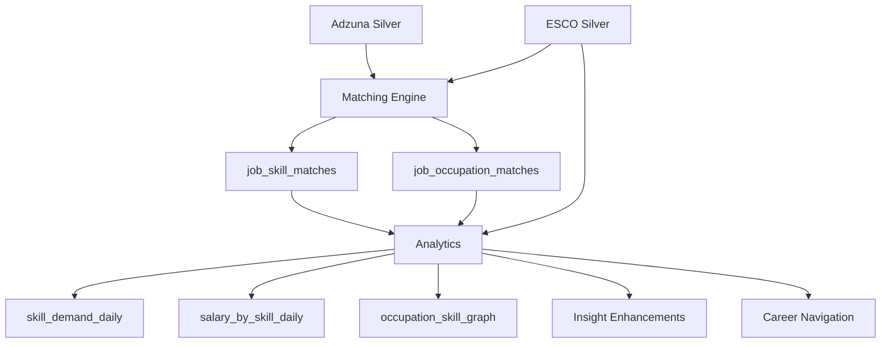

# Gold Pipeline

Cross-domain matching and analytics producing 12 analytical datasets from Silver tables.

## Purpose

Match Adzuna job postings against the ESCO taxonomy to identify skills and occupations, then compute aggregated analytics for demand, salary, career navigation, and emerging trends.

## Architecture



## Pipeline Phases

| Phase | Name | Datasets | Soft-fail? |
|-------|------|----------|-----------|
| 1 | Skill matching | `job_skill_matches` | No |
| 2 | Occupation matching | `job_occupation_matches` | No |
| 3 | Skill demand | `skill_demand_daily` | No |
| 4 | Salary analytics | `salary_by_skill_daily` | No |
| 5 | Occ-skill graph | `occupation_skill_graph` | No |
| 6 | Emerging skills | `skill_emerging_daily` | Yes |
| 7 | Occupation market + segments | `occupation_market_daily`, `skill_demand_segments_daily` | Yes |
| 8–11 | Career navigation | 4 datasets (profiles, similarity, transitions) | Yes |

Phases 6+ use the **soft-fail pattern**: `try/except` with `logger.warning`. Failures never break core pipeline.

## Phase 1 — Skill Matching

### Algorithm

1. **Build label dimension**: Collect all ESCO skill labels (preferred + alt) into a flat lookup with `(concept_uri, label, label_type)`
2. **Generate n-gram candidates**: Tokenize job titles/descriptions into 1–4 word n-grams
3. **Equi-join**: Join n-grams to label dimension on exact text match (case-insensitive)
4. **Score**: Apply deterministic scoring matrix based on `label_type × match_source`
5. **Dedup**: Keep highest-scoring match per `(job_id, skill_uri)`

### Scoring Matrix

| | Title | Description |
|---|---|---|
| **Preferred label** | 1.0 | 0.8 |
| **Alt label** | 0.9 | 0.7 |

## Phase 2 — Occupation Matching

### Methods

| Method | Logic | Confidence |
|--------|-------|-----------|
| `title_exact` | Job title matches preferred occupation label | 1.0 |
| `title_alt` | Job title matches alt occupation label | 0.9 |
| `skill_relation` | Inferred from matched skills via ESCO relations | 0.3–0.7 (by skill count) |

Skill-relation confidence is computed as: `supporting_skill_count / total_relations` (capped at 0.7).

## Phases 3–5 — Core Analytics

### skill_demand_daily

Aggregates `job_skill_matches` by skill:
- `jobs_count`, `companies_count`, `locations_count`
- `avg_match_score`, `title_match_count`, `description_match_count`

### salary_by_skill_daily

Joins `job_skill_matches` with salary data from Adzuna Silver:
- `salary_jobs_count`, `avg_salary_min`, `avg_salary_max`, `avg_salary_mean`

### occupation_skill_graph

Cross-joins matched jobs with ESCO occupation-skill relations:
- `relation_type` (essential/optional), `matched_jobs_count`

## Phases 6–7 — Insight Enhancements

See [Emerging Skills](../analytics/emerging-skills.md), [ML Features](../analytics/ml-features.md), and [Occupation Market](../analytics/occupation-market.md).

## Phases 8–11 — Career Navigation

See [Career Navigation](career-navigation.md) for the four career datasets (profiles, similarity, transitions).

## Write Strategy

All Gold tables use **Iceberg v2 dynamic partition overwrite**:
- Only the target `(country, ingestion_date)` partition is replaced
- Other partitions remain untouched
- Safe for re-runs and incremental processing

## Validation

37 validation checks across all Gold tables:
- `table_exists` — Iceberg table present in catalog
- `non_empty` — at least one row
- `schema` — required columns present
- `partition_non_empty` — target partition has data
- `positive_counts` — count columns ≥ 0
- `no_duplicates` — no duplicate composite keys
- `lineage` — pipeline version and timestamp present

## Module Map

```
src/skill_radar/domains/gold/
├── orchestrator.py              # Phase sequencing
├── schema.py                    # Column lists, required/key/count
├── matching/
│   ├── skill_matcher.py         # N-gram join, scoring, dedup
│   ├── occupation_matcher.py    # Title match + relation inference
│   └── models.py                # GoldMatchingResult, GoldAnalyticsResult
└── analytics/
    ├── orchestrator.py          # Phases 6-11
    ├── skill_demand.py          # Phase 3
    ├── salary.py                # Phase 4
    ├── occ_skill_graph.py       # Phase 5
    ├── emerging_skills.py       # Phase 6
    ├── occupation_market.py     # Phase 7a
    ├── skill_segments.py        # Phase 7b
    ├── occupation_profiles.py   # Phase 8
    ├── skill_profiles.py        # Phase 9
    ├── occupation_similarity.py # Phase 10
    └── occupation_transitions.py # Phase 11
```

## Testing

72 unit tests + 35 integration tests covering:
- Matching logic (n-gram generation, scoring, dedup)
- Analytics aggregation (demand, salary, graph)
- Schema validation (all 12 output tables)
- Integration with real Spark sessions

```bash
# Unit tests
uv run pytest tests/unit/domains/gold/ -v

# Integration tests (requires Spark)
uv run pytest tests/integration/domains/gold/ -v
```

## Operational Reference

```bash
# Full Gold pipeline
make run-gold GOLD_COUNTRY=fr

# CLI directly
skill-radar gold pipeline --ingestion-date 2025-01-15 --country fr \
  --esco-version v1.2.1 --esco-lang fr

# Matching only
skill-radar gold matching --ingestion-date 2025-01-15 --country fr \
  --esco-version v1.2.1 --esco-lang fr

# Analytics only
skill-radar gold analytics --ingestion-date 2025-01-15 --country fr \
  --esco-version v1.2.1 --esco-lang fr

# Validation
skill-radar validate gold --ingestion-date 2025-01-15 --country fr
```

## References

- [Pipeline Overview](overview.md) — full pipeline context
- [Data Model](../architecture/data-model.md) — complete Gold schemas
- [ESCO Pipeline](esco.md) — upstream ESCO data
- [Adzuna Pipeline](adzuna.md) — upstream Adzuna data
- [Search Pipeline](search.md) — downstream serving
