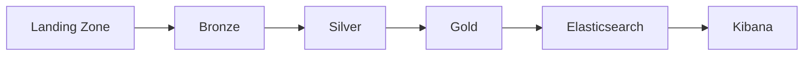

# Pipeline Overview

How data flows through the Skill Radar medallion architecture from raw ingestion to analytical output.

## Medallion Architecture

| Layer | Purpose | Guarantees |
|-------|---------|------------|
| **Landing** | Raw artifacts as received (ZIP, API responses) | Checksummed, manifested |
| **Bronze** | Row-level ingestion into Iceberg (full fidelity) | Append-only, lineage columns |
| **Silver** | Cleaned, normalized, deduplicated | Partition overwrite, typed columns |
| **Gold** | Cross-domain analytical datasets | Deterministic scoring, full lineage |
| **Serving** | Elasticsearch + Kibana | Alias-based routing, idempotent indexing |

## Data Sources

| Source | Type | Schedule | Pipeline |
|--------|------|----------|----------|
| ESCO | Static taxonomy (ZIP of CSVs) | Manual upload | [ESCO](esco.md) |
| Adzuna | REST API (job postings) | Daily (`0 6 * * *`) | [Adzuna](adzuna.md) |

## Pipeline Phases

The full pipeline (`make run-all`) executes these phases in order:

| Phase | Pipeline | Stages | Datasets |
|-------|----------|--------|----------|
| 1 | Infrastructure | Buckets, namespaces, Iceberg config | — |
| 2 | ESCO | Landing → Bronze → Silver | 9 entity types |
| 3 | Adzuna | API → Bronze → Silver | Jobs + request log |
| 4 | Gold (matching) | Job-skill + job-occupation matching | 2 match tables |
| 5 | Gold (analytics) | KPI aggregation | 3 core analytics |
| 6 | Gold (insights) | Emerging skills, market, segments | 3 enhancement datasets |
| 7 | Gold (career nav) | Profiles, similarity, transitions | 4 career datasets |
| 8 | Search | Gold → Elasticsearch → Kibana | 12 indices + 5 dashboards |

## Idempotency Model

Every stage is designed for safe re-runs:

- **Landing**: Checksummed artifacts with manifest — re-upload replaces atomically
- **Bronze**: Append-only for Adzuna; partition overwrite for ESCO
- **Silver**: Partition overwrite mode (`dynamic`) — replaces target partition only
- **Gold**: Partition overwrite — recomputes target `(country, ingestion_date)` partition
- **Search**: Deterministic document IDs (SHA-256) — re-indexing is a no-op

## Orchestration

Pipelines can be run via:

1. **Makefile** — `make run-all`, `make run-esco-bronze`, etc.
2. **CLI** — `skill-radar run gold --ingestion-date ...`
3. **Airflow DAGs** — scheduled or manual trigger via DockerOperator

See [Airflow Orchestration](../platform/airflow.md) for DAG-based execution.

## References

- [ESCO Pipeline](esco.md) — taxonomy ingestion
- [Adzuna Pipeline](adzuna.md) — job posting ingestion
- [Gold Pipeline](gold.md) — matching and analytics
- [Search Pipeline](search.md) — Elasticsearch serving
- [Career Navigation](career-navigation.md) — career analytics extension
