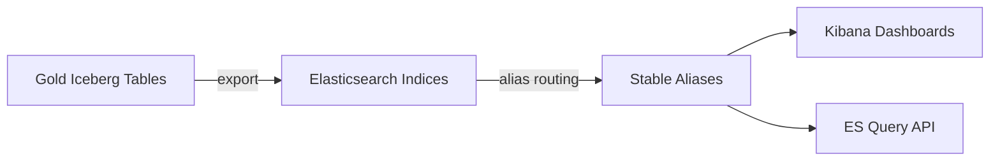

# Search Pipeline

Exporting Gold Iceberg tables to Elasticsearch and serving via Kibana dashboards.

## Purpose

Elasticsearch acts as a derived serving layer for Gold data. Iceberg remains the source of truth; Elasticsearch enables fast querying and Kibana visualization.

## Architecture



## Design Principles

- **Gold is truth**: ES indices can be rebuilt from Iceberg at any time
- **Deterministic IDs**: Each document has a SHA-256 doc_id (truncated to 20 hex chars) for idempotent re-indexing
- **Alias-based routing**: Queries hit stable aliases (`skillradar-{dataset}-{country}`) while physical indices are date-versioned

## Served Datasets

| Dataset | Primary? | Description |
|---------|----------|-------------|
| `skill_demand_daily` | Yes | Daily skill demand aggregates |
| `salary_by_skill_daily` | Yes | Salary statistics per skill |
| `occupation_skill_graph` | Yes | Occupation ↔ skill relationships |
| `occupation_profile_daily` | Yes | Rich occupation profiles |
| `skill_profile_daily` | Yes | Detailed skill profiles |
| `occupation_similarity_daily` | Yes | Pairwise occupation similarity |
| `occupation_transition_daily` | Yes | Career transition guidance |
| `skill_emerging_daily` | Yes | Emerging skill scores |
| `occupation_market_daily` | Yes | Occupation market indicators |
| `skill_demand_segments_daily` | Yes | Demand by segment |
| `job_skill_matches` | No | Per-job skill matches |
| `job_occupation_matches` | No | Per-job occupation matches |

Primary datasets are always exported. Job-level datasets can be included via `--dataset` flag.

## Index Naming

| Component | Pattern | Example |
|-----------|---------|---------|
| Physical index | `{prefix}-{dataset}-{country}-{date}` | `skillradar-skill-demand-daily-fr-2025.01.15` |
| Alias | `{prefix}-{dataset}-{country}` | `skillradar-skill-demand-daily-fr` |

Aliases provide stable query endpoints. Physical indices enable atomic daily swaps and historical retention.

## Document ID Strategy

Documents use deterministic IDs from partition keys + primary keys:

| Dataset | ID Components |
|---------|--------------|
| `skill_demand_daily` | `country \| ingestion_date \| skill_uri` |
| `salary_by_skill_daily` | `country \| ingestion_date \| skill_uri` |
| `occupation_skill_graph` | `country \| ingestion_date \| occ_uri \| skill_uri` |
| `job_skill_matches` | `country \| ingestion_date \| job_id \| skill_uri` |
| `job_occupation_matches` | `country \| ingestion_date \| job_id \| occ_uri \| method` |

IDs are SHA-256 hashed, truncated to 20 hex characters.

## Export Workflow

1. Read Gold Iceberg partition for `(country, ingestion_date)`
2. Transform Spark Rows to ES documents via dataset-specific document builders
3. Create date-versioned physical index with mapping
4. Bulk-index documents with deterministic IDs
5. Optionally swap alias to new index
6. Optionally refresh index

## Configuration

### Environment Variables

| Variable | Default | Description |
|----------|---------|-------------|
| `SKILLRADAR_SEARCH_ELASTICSEARCH_URL` | `http://localhost:9200` | ES URL (host) |
| `SKILLRADAR_SEARCH_ELASTICSEARCH_URL_DOCKER` | `http://elasticsearch:9200` | ES URL (Docker) |
| `SKILLRADAR_SEARCH_KIBANA_URL` | `http://localhost:5601` | Kibana URL |
| `SKILLRADAR_SEARCH_INDEX_PREFIX` | `skillradar` | Index name prefix |
| `SKILLRADAR_SEARCH_INDEX_SHARDS` | `1` | Shards per index |
| `SKILLRADAR_SEARCH_INDEX_REPLICAS` | `0` | Replicas per index |
| `SKILLRADAR_SEARCH_BULK_CHUNK_SIZE` | `500` | Documents per bulk request |

## CLI Reference

```bash
# Export Gold → ES
skill-radar search export --ingestion-date 2025-01-15 --country fr \
  [--dataset skill_demand_daily] [--alias-swap] [--refresh] [--dry-run]

# Bootstrap Kibana data views
skill-radar search bootstrap-kibana [--apply]

# Generate dashboard NDJSON
skill-radar search dashboard export [--output-dir ./configs/kibana]

# Apply dashboards to Kibana
skill-radar search dashboard apply [--dry-run] [--overwrite]

# Validate indices + Kibana
skill-radar validate search --ingestion-date 2025-01-15 --country fr
```

## Module Map

```
src/skill_radar/
├── domains/search/
│   ├── orchestrator.py       # End-to-end export, bootstrap, dashboard workflow
│   ├── datasets.py           # ServedDataset registry (12 datasets)
│   ├── documents.py          # Row → ES document builders (12 builders)
│   └── kibana_metadata.py    # Dashboard dataset metadata
└── platform/search/
    ├── elasticsearch.py      # ES HTTP client (CRUD, bulk, alias)
    ├── kibana.py             # Kibana saved objects API
    ├── mappings.py           # 12 ES index mappings
    ├── naming.py             # Index/alias name construction
    ├── kibana_models.py      # Typed saved object representations
    ├── kibana_builders.py    # Lens visualization constructors
    └── kibana_assets.py      # NDJSON generation
```

## Operational Reference

```bash
# Start search stack
make search-up

# Full search pipeline
make run-search SEARCH_COUNTRY=fr SEARCH_INGESTION_DATE=2025-01-15

# Individual steps
make export-search SEARCH_COUNTRY=fr SEARCH_INGESTION_DATE=2025-01-15
make bootstrap-kibana
make apply-kibana-assets
make validate-search SEARCH_COUNTRY=fr SEARCH_INGESTION_DATE=2025-01-15

# Troubleshooting
curl -s http://localhost:9200/_cluster/health | jq
curl -s http://localhost:9200/_cat/indices?v
curl -s http://localhost:9200/_cat/aliases?v
```

## References

- [Dashboard Overview](../dashboards/overview.md) — code-managed dashboards
- [Kibana Dashboards](../dashboards/kibana.md) — dashboard inventory
- [Gold Pipeline](gold.md) — upstream data
- [Pipeline Overview](overview.md) — full pipeline context
