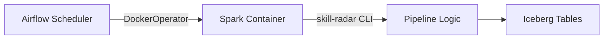
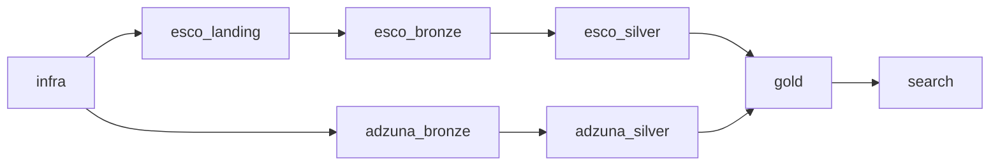

# Airflow Orchestration

DAG-based pipeline scheduling via DockerOperator — Airflow as control-plane only.

## Purpose

Airflow schedules and monitors pipeline execution. All business logic runs inside ephemeral Docker containers launched via `DockerOperator` — no Python processing happens inside Airflow itself.

## Execution Model



Each Airflow task:
1. Launches a fresh Docker container from the Spark image
2. Runs a `skill-radar run ...` CLI command inside the container
3. Captures exit code and logs
4. Container is destroyed after completion

Benefits: isolation, reproducibility, no dependency conflicts, same image in dev/CI/prod.

## DAG Inventory

| DAG | Schedule | Trigger | Description |
|-----|----------|---------|-------------|
| `adzuna_daily_pipeline` | `0 6 * * *` | Automatic | Adzuna Bronze → Silver → Gold → Search |
| `esco_manual_pipeline` | None | Manual | ESCO Upload → Bronze → Silver (+ optional Gold) |
| `full_pipeline` | None | Manual | End-to-end: Infra → ESCO + Adzuna → Gold → Search |

### full_pipeline DAG Structure



ESCO and Adzuna branches run in **parallel**, converging at Gold.

## Shared Layer

The `dags/_shared/` package provides reusable DAG building blocks:

| Module | Purpose |
|--------|---------|
| `config.py` | Centralized DAG configuration (image, volumes, network, env) |
| `docker_tasks.py` | `make_skill_radar_task()` factory for DockerOperator tasks |
| `defaults.py` | Default DAG arguments (retries, owner, email) |
| `callbacks.py` | Success/failure callback handlers |
| `templates.py` | Jinja2 template helpers for dynamic commands |

### Task Factory

```python
from _shared.docker_tasks import make_skill_radar_task

task = make_skill_radar_task(
    task_id="adzuna_bronze",
    command="skill-radar run adzuna-bronze --country {{ params.country }}",
    dag=dag,
)
```

The factory handles: image selection, volume mounts (data, configs), network attachment, environment variable passthrough, and container cleanup.

## Configuration Reference

### Environment Variables

| Variable | Description | Default |
|----------|-------------|---------|
| `SKILLRADAR_AIRFLOW_IMAGE` | Spark image for DockerOperator | From docker-compose |
| `SKILLRADAR_DOCKER_NETWORK` | Docker network for containers | `skill-radar_default` |
| `SKILLRADAR_ADZUNA_SCHEDULE` | Cron for daily Adzuna DAG | `0 6 * * *` |
| `SKILLRADAR_ESCO_VERSION` | ESCO version for DAG parameters | `v1.2.0` |
| `SKILLRADAR_ESCO_LANG` | ESCO language | `fr` |
| `SKILLRADAR_ADZUNA_COUNTRY` | Default country for Adzuna | `fr` |

### Docker Volumes

Mounted into every task container:
- `./data/incoming/esco` → `/opt/skillradar/incoming/esco` (ESCO dropzone)
- `./configs` → `/opt/skillradar/configs` (Spark config)
- Docker socket → `/var/run/docker.sock` (for nested containers if needed)

## Operational Runbook

### Start/Stop

```bash
make airflow-up       # Start scheduler + webserver
make airflow-down     # Stop gracefully
make airflow-reset    # Stop + remove volumes
```

### Trigger DAGs

```bash
# Via Makefile
make airflow-trigger-adzuna
make airflow-trigger-esco

# Via Airflow CLI
docker compose exec airflow-scheduler airflow dags trigger adzuna_daily_pipeline
docker compose exec airflow-scheduler airflow dags trigger full_pipeline \
  --conf '{"country": "fr", "esco_version": "v1.2.1"}'
```

### Web UI

http://localhost:8085 — credentials: `admin` / `admin`

### Smoke Check

```bash
make airflow-smoke    # Verifies DockerOperator prerequisites
```

Checks: Docker socket accessible, Spark image pullable, network exists, volume mounts valid.

## Testing

34 unit tests covering:
- DAG loading and validation (no import errors)
- Task factory configuration
- Shared layer functions
- Template rendering

```bash
uv run pytest tests/unit/dags/ -v
```

## Module Map

```
dags/
├── adzuna_daily_pipeline.py    # Daily Adzuna DAG
├── esco_manual_pipeline.py     # Manual ESCO DAG
├── full_pipeline.py            # End-to-end DAG
└── _shared/
    ├── __init__.py
    ├── config.py               # Image, volumes, network config
    ├── docker_tasks.py         # make_skill_radar_task() factory
    ├── defaults.py             # Default DAG arguments
    ├── callbacks.py            # Success/failure handlers
    └── templates.py            # Jinja2 helpers
```

## References

- [Running the Project](../getting-started/running-the-project.md) — Makefile targets
- [Command Reference](command-reference.md) — full CLI reference
- [Pipeline Overview](../pipelines/overview.md) — pipeline architecture
