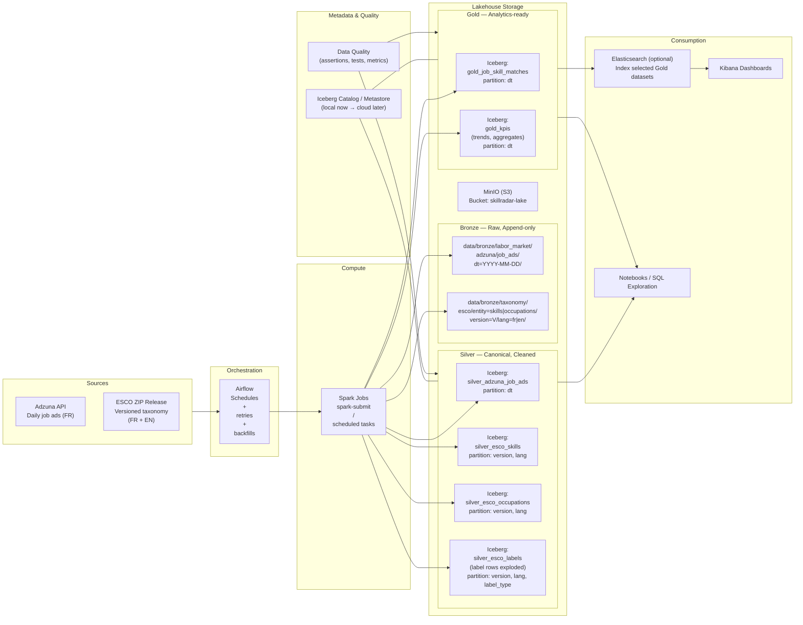

# Skill Radar — Project Specification<br>(Production-Aligned Big Data Pipeline)

## 1. Context

The labor market is a high-frequency signal of technology adoption: new tools, frameworks, cloud services, data platforms, and AI skills appear first in job ads and then propagate through industry. However, job ads are noisy, heterogeneous, and evolving (synonyms, spelling variants, multilingual terms). A robust pipeline must handle:

- Daily ingestion and incremental updates
- Idempotency and deduplication
- Taxonomy-driven normalization (skills and occupations)
- Reproducible storage and transformations
- Reliable KPIs for trend analysis and dashboards

Skill Radar is built as a **production-oriented data engineering project** aiming to demonstrate **lakehouse-grade architecture** and professional workflow (CI, validation, structured storage contracts).

---

## 2. Goal

Skill Radar builds a complete data pipeline that:

1. Ingests job postings daily from Adzuna (France focus).
2. Ingests a versioned, static taxonomy dataset (ESCO skills + occupations) in **French and English**.
3. Standardizes and normalizes the raw data into a consistent lakehouse representation.
4. Extracts structured signals from text (skills, occupations, entities).
5. Produces analytics-ready datasets and KPIs for exploration and dashboards.

The long-term deliverable is a reproducible, production-like pipeline that can be deployed to cloud later (AWS/GCP/Azure), using the same patterns already applied locally.

---

## 3. Data Sources

### 3.1 Adzuna API (Dynamic / Daily)

- Country requested: **FR**
- Contains:
  - job title
  - job description
  - category
  - location
  - salary fields (if present)
  - company information (if present)
  - posting date / created date
  - adzuna job id (or equivalent unique key)

**Characteristics**
- High variability in text quality and language
- Risk of duplicates across runs
- Needs incremental ingestion and idempotent logic

---

### 3.2 ESCO Dataset (Static but Versioned)

ESCO is distributed as a zip containing multiple CSV files. We focus on:

#### `skills_<lang>.csv`

Main columns:
- `skillType` ∈ {`skill/competence`, `knowledge`, null}
- `reuseLevel` ∈ {`sector-specific`, `occupation-specific`, `cross-sector`, `transversal`, null}
- `preferredLabel` (string)
- `altLabels` (string, labels separated by `\n`)
- `hiddenLabels` (string, labels separated by `\n`)
- `description` (string)

Definitions:
- **altLabels**: synonyms or variants (spelling, abbreviations, declensions)
- **hiddenLabels**: terms used in the market but outdated/misspelled/politically incorrect

#### `occupations_<lang>.csv`

Main columns:
- `preferredLabel`
- `altLabels`
- `hiddenLabels`
- `description`

**Characteristics**
- Static file per version
- Must ingest in a versioned manner
- Must parse multi-valued label fields into normalized structures (or token tables)

---

## 4. Value Proposition

Skill Radar creates value in several ways:

### 4.1 Data Engineering Value
- Demonstrates a full lakehouse pipeline lifecycle: bronze → silver → gold
- Enforces a storage contract and consistent partitioning
- Uses open table format (Iceberg) for reliability and evolution
- Establishes CI/validation discipline and reproducible dev workflow

### 4.2 Analytics Value
From job ads + taxonomy, Skill Radar can produce:
- Skill demand trends over time (frequency / growth rate)
- Emerging skills detection (acceleration, novelty, cohort adoption)
- Salary distribution by skill / group / region
- Location-based demand patterns
- Occupation ↔ skills relationship insights

### 4.3 Product Value
Supports dashboards and search:
- Kibana / Elasticsearch can index selected Gold datasets
- Enables interactive querying and visualization

---

## 5. High-Level Architecture

Skill Radar uses a local-first stack that mirrors production:

### 5.1 Logical Components

- **Object Storage**: MinIO (S3-compatible)
- **Table Format**: Apache Iceberg (transactional tables)
- **Compute**: Apache Spark (batch processing)
- **Orchestration (future)**: Airflow
- **Serving / Observability (future)**: Elasticsearch + Kibana
- **Validation + CI**: pytest + ruff + mypy + GitHub Actions
- **Developer Interface**: Makefile + doctor script

---

## 6. Data Lake / Lakehouse Layout

### 6.1 Storage Contract

All stored data must follow:
```bash
data/<layer>/<domain>/<source>/<entity>/<version_or_dt>/<partitions…>
```

**Layer**: `bronze`, `silver`, `gold`

**Domain** examples:
- `labor_market`
- `taxonomy`
- `analytics`

**Source** examples:
- `adzuna`
- `esco`

**Entity** examples:
- `job_ads`
- `skills`
- `occupations`
- `skill_aliases`
- `occupation_aliases`

**Version or date**
- ESCO: `version=<esco_version>`
- Adzuna: `dt=<yyyy-mm-dd>`

Examples:
- `data/bronze/labor_market/adzuna/job_ads/dt=2026-03-02/`
- `data/bronze/taxonomy/esco/skills/version=2025.XX/`
- `data/silver/taxonomy/esco/skill_aliases/version=2025.XX/`

---

## 7. Data Flow (End-to-End)

### 7.1 Milestone 1 — Infrastructure Bootstrap (Completed)

**Objective**
- Ensure Spark can read/write Iceberg tables stored on MinIO
- Ensure catalog configuration and connectivity
- Provide smoke test and dev workflow

**Acceptance Criteria**
- Docker stack starts reliably (`make infra`)
- Smoke test creates namespaces and writes a test table in Iceberg
- Logs captured cleanly for debugging
- Makefile provides structured feedback and failures

---

### 7.2 Milestone 2 — Bronze Ingestion

**Goal**
- Ingest Adzuna daily ads (FR only) into bronze storage
- Ingest ESCO skills + occupations (FR + EN) into bronze storage
- Ensure versioning and idempotency

**Bronze Rules**
- Minimal transformations
- Keep raw fields (as close as possible to source)
- Add metadata columns for traceability:
  - `ingestion_ts`
  - `source`
  - `source_version` (ESCO)
  - `run_id` (optional)
  - `dt` partition for Adzuna
  - `lang` for ESCO datasets
- Store as Iceberg tables (preferred) or Parquet + manifest (if needed early)

**Bronze Entities**
- `adzuna_job_ads_raw`
- `esco_skills_raw`
- `esco_occupations_raw`

---

### 7.3 Milestone 3 — Silver Normalization

**Goal**
- Clean, standardize and normalize schemas
- Introduce consistent typing
- Create normalized label tables for ESCO:
  - split `altLabels` and `hiddenLabels`
  - normalize tokens (lowercase, trim, unicode normalization)
  - map label → concept id
- Create deduplicated canonical job ads dataset

**Silver Entities**
- `adzuna_job_ads` (normalized schema)
- `esco_skills` (normalized schema)
- `esco_skill_labels` (one label per row)
- `esco_occupations`
- `esco_occupation_labels`

---

### 7.4 Milestone 4 — Gold Analytics

**Goal**
- Build analytics-ready datasets and KPIs:
  - skill counts per day/week/month
  - trending skills
  - salary stats by skill
  - location-based demand
  - occupation ↔ skill graph

**Gold Entities**
- `kpi_skill_demand_daily`
- `kpi_skill_demand_monthly`
- `kpi_salary_by_skill`
- `kpi_geo_skill_heatmap`
- `kpi_emerging_skills`

---



---

## 8. Technology Stack and Roles

### 8.1 MinIO (S3)
- Stores data lake objects
- Provides S3-compatible API
- Enables cloud portability later (AWS S3 / GCS compatible layers)

### 8.2 Apache Iceberg
- Transactional tables on object storage
- Enables:
  - schema evolution
  - partition evolution
  - ACID guarantees
  - time travel (optional)
- Production-aligned open format

### 8.3 Apache Spark
- Distributed processing engine
- Runs ingestion jobs and transformations
- Writes Iceberg tables to MinIO via S3A connector

### 8.4 Python Package (`src/skill_radar`)
- Reusable code:
  - configuration management
  - logging utilities
  - assertions/validation helpers
  - schema definitions
  - IO helpers (S3A, Iceberg)

### 8.5 Jobs (`jobs/`)
- Spark entry points:
  - one job per dataset or pipeline step
  - typically `spark-submit jobs/<...>.py`
- Should import reusable code from `src/skill_radar`

### 8.6 Testing
- Unit tests: pure Python functions and transformations
- Integration tests: require docker infra and validate table writes/reads

### 8.7 CI (GitHub Actions)
- Runs lint/format/type/unit tests
- Later: integration tests as a separate job

---

## 9. Professional Engineering Spec to Follow

This is the operational spec that should guide implementation.

### 9.1 Storage and Naming Rules
- All datasets must map to a well-defined `<domain>/<source>/<entity>`
- Iceberg tables should have stable canonical names
- Partitioning:
  - Adzuna: partition by `dt`
  - ESCO: partition by `version` and `lang` (or keep as table metadata fields)

### 9.2 Idempotency Rules
- Adzuna ingestion must not create duplicates:
  - enforce unique key (e.g., `adzuna_id`, or `hash(url + created + title + company)`)
  - upsert/merge strategy in Iceberg (when supported)
- ESCO ingestion:
  - write under version namespace and do not overwrite previous versions
  - re-ingestion of same version must be safe (overwrite allowed, but deterministic)

### 9.3 Traceability
Every dataset must include:
- ingestion timestamp
- run id (optional)
- source metadata
- schema version (optional)

### 9.4 Quality Gates
For each milestone:
- add unit tests for core transformations
- add integration tests for IO + Iceberg writes
- enforce ruff + mypy + pytest in CI

### 9.5 Observability
- All Spark jobs should:
  - log key parameters
  - log input/output table names
  - log row counts / null ratios for critical fields
- Long logs captured to `logs/` (already supported by Makefile patterns)

---

## 10. Development Workflow (Team of Two)

### 10.1 Local Setup
- `make bootstrap`
- `make infra` (start stack + smoke test)

### 10.2 Daily Dev Cycle
- `make quality`
- `make dev` (quality + infra health)

### 10.3 Before PR
- `make ci` (full pipeline)

### 10.4 Branching
- Work off `develop`
- Use:
  - `infra/...`
  - `feature/...`
  - `chore/...`
  - `fix/...`

---

## 11. Deliverables

### Milestone 1 (Infra)
- docker-compose stack
- spark-defaults config
- smoke test
- Makefile UX and orchestration
- doctor infra validation
- docs/architecture/ files
- CI quality pipeline

### Milestone 2 (Bronze)
- Adzuna FR ingestion job
- ESCO (FR+EN) ingestion job
- Bronze Iceberg tables
- Partitioning + metadata columns
- Unit + integration tests

### Milestone 3 (Silver)
- schema normalization
- label normalization tables
- deduplication logic
- standardized types and constraints

### Milestone 4 (Gold)
- KPI tables
- dashboards indexing (Elastic/Kibana)
- final analytics outputs

---

## 12. Definition of Done (DoD)

A milestone is considered complete when:

- The data contracts are explicit (layout + schemas)
- Jobs are deterministic and idempotent
- Required tests exist and pass
- CI passes consistently
- Docs describe architecture and how to run it
- Developer workflow is ergonomic (`make` targets, logs, diagnostics)

---

## 13. Next Step: Start Milestone 2 (Bronze)

Immediate implementation tasks:

1. Add ESCO ingestion:
   - download ESCO zip
   - extract required CSVs
   - store in bronze tables versioned by `version` and `lang`

2. Add Adzuna ingestion:
   - query daily results for FR
   - store in bronze partitioned by `dt`
   - enforce idempotency key

3. Add minimal validations:
   - schema checks
   - row-count checks
   - required columns non-null constraints

4. Add integration tests:
   - write/append to Iceberg tables
   - verify partitions and row counts

Once Bronze is stable, proceed to Silver normalization and taxonomy-driven enrichment.
